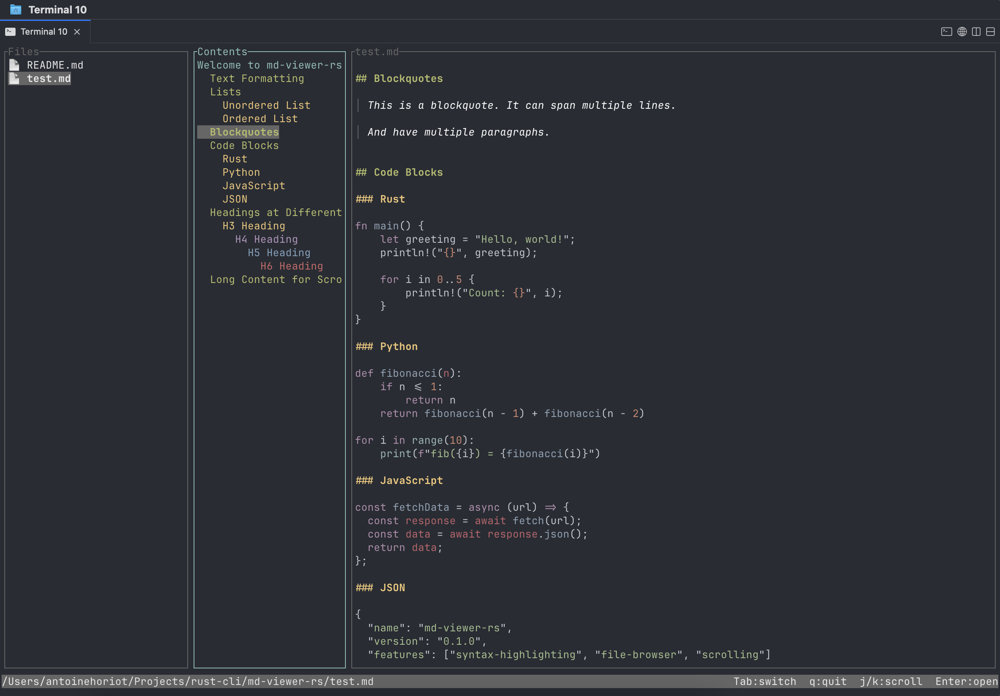

# readmd

A TUI markdown viewer built with Rust. Browse and read markdown files in your terminal with syntax-highlighted code blocks.

[](https://crates.io/crates/readmd)




## Features

- **File browser sidebar** — navigate directories, expand/collapse, filtered to `.md` files only
- **Table of contents panel** — auto-generated from headings, jump to any section with Enter
- **Markdown rendering** — headings, bold, italic, links, lists, blockquotes, horizontal rules
- **Syntax highlighting** — fenced code blocks highlighted via syntect
- **Keyboard-driven** — vim-style navigation (j/k), scrolling, focus switching

## Install

```bash
cargo install readmd
```

## Usage

```bash
# Browse current directory
readmd

# Browse a specific directory
readmd ~/notes
```

## Key Bindings

| Key | Action |
|---|---|
| `Tab` | Cycle focus: Files → TOC → Content |
| `j` / `k` or arrows | Navigate / scroll |
| `Enter` / `Right` | Open file, expand directory, or jump to heading |
| `Left` | Collapse directory |
| `PageUp` / `PageDown` | Page scroll |
| `Home` / `g`, `End` / `G` | Jump to top / bottom |
| `q` / `Ctrl+C` | Quit |

## Dependencies

- [ratatui](https://github.com/ratatui/ratatui) — terminal UI framework
- [crossterm](https://github.com/crossterm-rs/crossterm) — terminal input/output
- [pulldown-cmark](https://github.com/raphlinus/pulldown-cmark) — markdown parsing
- [syntect](https://github.com/trishume/syntect) — syntax highlighting
- [clap](https://github.com/clap-rs/clap) — CLI argument parsing
